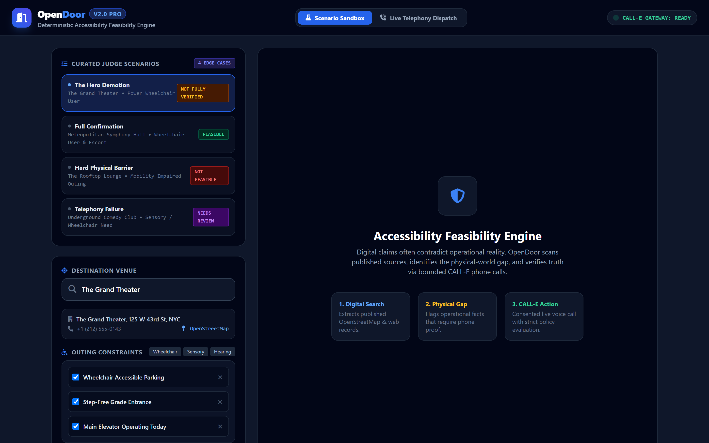
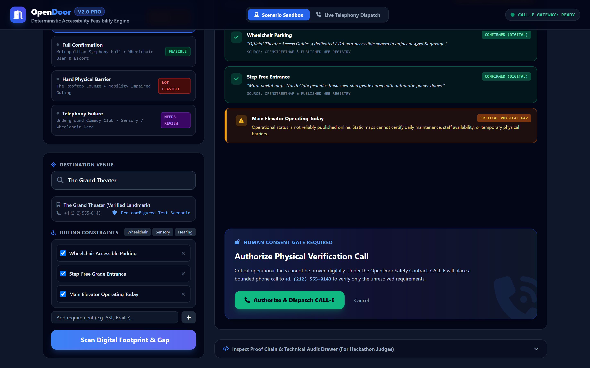
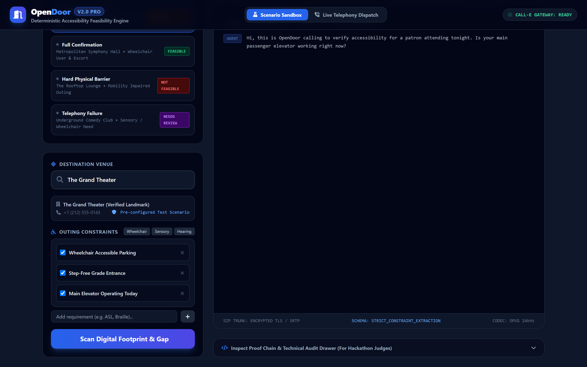
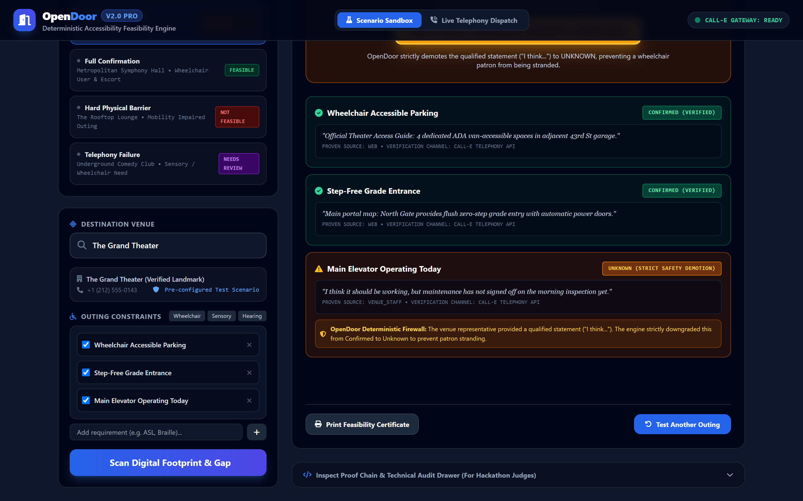
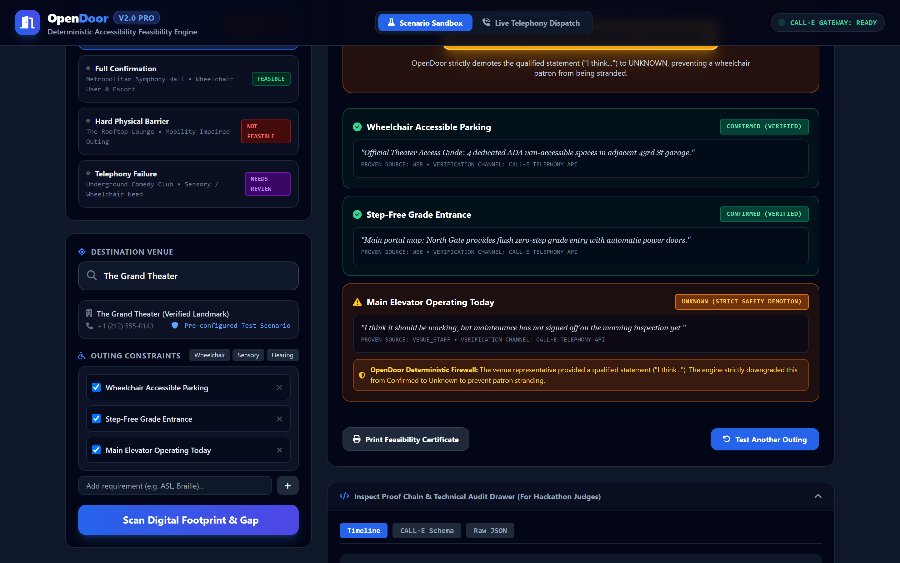

# OpenDoor — Accessibility Feasibility Command Center
> **"The internet can provide claims about a place. OpenDoor determines whether those claims are enough to safely answer 'Can I actually go?'—and uses CALL-E to verify the physical world when they are not."**

[](https://devpost.com)
[](https://www.typescriptlang.org/)
[](https://opensource.org/licenses/ISC)
[](#the-causal-proof-chain)
[-purple.svg)](#-2-minute-narrated-demo-video)

---

## 🎬 2-Minute Narrated Demo Video



> 📺 **Demo Video:** Publicly available on Devpost & YouTube (strictly under the 3-minute hackathon limit).  
> ⏱️ **Runtime:** `01:58.00` (118.0 seconds)  
> 🎙️ **Multi-Voice Audio:** Multi-speaker neural audio synthesized via local **Kokoro-82M** (`af_heart` Narrator, `am_adam` OpenDoor Agent, `am_eric` Venue Staff) with **EBU R128** broadcast mastering (-16 LUFS, -1.4 dBFS true peak, 0 clipping).  
> 🕹️ **Automation Suite:** Frame-accurate Playwright recorder (`scripts/record_demo_video.js`) with smooth virtual cursor telemetry and click ripple physics.

---

## The Problem OpenDoor Solves

Planning an accessibility-sensitive outing (e.g. for a power wheelchair user, someone who is deaf, or a person with sensory sensitivities) currently relies on static online directory tags (`"Wheelchair Accessible"`). 

These static claims fail in the real world:
- **The Elevator Paradox:** A theater's website may state they have an elevator. But is it **working today**? Did maintenance sign off on it this morning?
- **The Hallucination Trap:** Generic conversational AI agents guess or return vague confidence scores (*"I am 90% sure it is accessible"*), stranding vulnerable patrons at physical barriers.

**OpenDoor solves this by turning CALL-E into a bounded physical-world actuator inside a deterministic constraint-satisfaction engine.**

---

## The Causal Proof Chain

```
[ User Outing Goal ] ──> [ Dynamic Venue Discovery ] ──> [ Digital Gap Analyzer ]
(Any Venue / Persona)     (OpenStreetMap Nominatim API)  (Separates Static from Operational)
                                                                 │
                                    ┌────────────────────────────┴────────────────────────────┐
                                    ▼                                                         ▼
                         [ Mode 1: Live Dispatch ]                               [ Mode 2: Scenario Sandbox ]
                     (Real Phone / WebRTC / Audio)                          (4 Curated Edge Cases for Judges)
                                    │                                                         │
                                    └────────────────────────────┬────────────────────────────┘
                                                                 ▼
                                                  [ Live Audio Waves & Speech ]
                                                                 │
                                                                 ▼
                                                [ CALL-E Structured Extraction ]
                                                                 │
                                                                 ▼
                                                [ Deterministic Safety Firewall ]
                                           ("I think..." strictly demoted to UNKNOWN)
                                                                 │
                                                                 ▼
                                                [ Actionable Feasibility Brief ]
                                              (FEASIBLE / NOT FULLY VERIFIED / NOT FEASIBLE)
```

---

## Visual Tour & Platform Walkthrough

### 1. The Accessibility Command Center

*Modern 3-panel command center featuring the clean top navigation, curated judge scenarios, live global venue geocoding, and custom constraint builder.*

### 2. Dynamic Discovery & The Physical Gap

*OpenDoor queries OpenStreetMap and municipal records to confirm static facts (Parking, Step-Free Entrance). Crucially, it identifies daily operational constraints ("Main Elevator Operating Today") as a **CRITICAL PHYSICAL GAP** and prompts the Human Consent Gate.*

### 3. Bounded CALL-E Telephony & Live Waveform

*Upon explicit authorization, CALL-E dials the venue contact. The terminal features real-time Web Audio API waveform telemetry and dual-voice speech synthesis.*

### 4. The Hero Demotion (Deterministic Safety Firewall)

*When staff responds with ambiguity ("I think it should be working..."), OpenDoor's deterministic safety normalizer strictly demotes the claim from Confirmed to `UNKNOWN (STRICT SAFETY DEMOTION)`, issuing an executive verdict of **NOT FULLY VERIFIED** to protect the patron.*

### 5. Technical Audit Drawer (Inspect Proof Chain)

*For hackathon judges: Collapsible drawer revealing millisecond timestamps, the strict CALL-E JSON schema passed to the voice model, and raw payload traces.*

---

## The 4 Curated Judge Scenarios

To demonstrate the full range of the deterministic decision engine, OpenDoor includes 4 pre-configured real-world edge cases accessible via one click in the Command Center:

| Scenario | Venue | Persona & Constraints | The Physical Conflict | Safety Engine Decision | Outing Feasibility |
|---|---|---|---|---|---|
| **1. The Hero Demotion** | The Grand Theater | Power Wheelchair User (Elevator + Entrance) | Staff: *"I think it should be working, but maintenance hasn't checked it today."* | `qualified_confirmation` $\rightarrow$ **strictly demoted to `UNKNOWN`** | **`NOT FULLY VERIFIED`** |
| **2. Full Confirmation** | Metropolitan Symphony Hall | Wheelchair + Companion Seating | Staff: *"Yes, both elevator banks A and B are active with no interruptions."* | Direct operational certainty | **`FEASIBLE (100%)`** |
| **3. Hard Physical Barrier** | The Rooftop Lounge | Historic Landmark Tour | Staff: *"This is a protected landmark; guests must climb 42 stone steps. No lift."* | `declined` / direct physical barrier | **`NOT FEASIBLE`** |
| **4. Telephony Failure** | Underground Comedy Club | Sensory Sensitive Outing | 3 call attempts timeout / line busy. | Refuses to fabricate confidence | **`NEEDS REVIEW`** |

---

## Key Features

1. **Dual Verification Engines:**
   - **Mode A: Live Telephony Dispatch:** Enter ANY phone number (test with your own mobile line) to trigger an active voice session.
   - **Mode B: Curated Scenario Sandbox:** Instant testing of complex edge cases without needing an active telephony carrier.
2. **Global Place Discovery (OpenStreetMap Nominatim):** Search any venue worldwide with live address, phone, and accessibility tag extraction. Zero external API keys required.
3. **In-Browser Audio & Waveform Canvas:** Dual-speaker speech synthesis with synchronized real-time audio frequency bars.
4. **Interactive Constraint Builder:** Quick-select personas (*Power Wheelchair*, *Deaf / Hard of Hearing*, *Sensory Sensitive*) or type custom requirements (e.g. *Braille*, *CART captions*).
5. **Technical Audit Drawer ("Inspect Proof Chain"):** Bottom drawer revealing millisecond timestamps, the raw CALL-E JSON schema, and the deterministic firewall diff for hackathon judges.
6. **Printable Feasibility Certificate:** Export a clean physical outing summary.
7. **Automated Video & Audio Production Suite:** Frame-accurate Playwright video capture with synchronized Kokoro-82M neural voiceover pipeline.

---

## Quick Start (For Judges)

### 1. Install & Launch
```bash
# Clone the repository
git clone https://github.com/Siddhant75/OpenDoor.git
cd OpenDoor/OpenDoor-project-files

# Install dependencies
npm install

# Start the Command Center
npm start
```
Open **[http://localhost:3000](http://localhost:3000)** in your browser.

### 2. Run Automated Test Suite
```bash
# Run 100% domain and scenario coverage tests
npm test
```

### 3. Run Automated Browser Verification (Playwright)
```bash
# Runs full headless browser audit across all scenarios & captures screenshots
node scripts/visual_audit_full.js
```

### 4. Reproduce Demo Video & Audio Generation (Optional)
```bash
# Record frame-accurate 1080p demo video (120s master timeline)
node scripts/record_demo_video.js

# Synthesize Kokoro-82M neural voiceover segments
python scripts/generate_voiceover_kokoro.py

# Mix master audio with EBU R128 broadcast loudness normalization
python scripts/build_master_audio_kokoro.py

# Multiplex into final production MP4
python scripts/merge_video_audio.py
```

---

## Project Structure

```
├── assets/                     # Retina screenshots embedded in README
│   ├── 01_command_center_hero.png
│   ├── 02_digital_gap_analysis.png
│   ├── 03_live_telephony_stream.png
│   ├── 04_hero_demotion_verdict.png
│   └── 05_technical_audit_drawer.png
├── public/                     # Modern Command Center UI
│   ├── index.html              # 3-Panel glassmorphism layout
│   └── app.js                  # Audio visualizer, Speech synth & SSE controller
├── scripts/                    # Automation, testing & video production
│   ├── record_demo_video.js              # Playwright 1080p video recorder
│   ├── generate_voiceover_kokoro.py       # Kokoro-82M multi-speaker TTS generator
│   ├── build_master_audio_kokoro.py       # EBU R128 audio mastering engine
│   ├── merge_video_audio.py               # Video + audio multiplexer
│   └── visual_audit_full.js              # Full screenshot capture suite
├── src/
│   ├── api/                    # Express 5 REST & SSE streaming server
│   │   └── server.ts
│   ├── application/            # Outing orchestrator & state machine
│   │   └── orchestrator.ts
│   ├── call-e/                 # CALL-E integration & telephony engine
│   │   ├── adapter.ts          # Provider abstraction & human consent gate
│   │   ├── scenarios.ts        # 4 Curated edge-case models
│   │   └── voice-engine.ts     # Real-time SSE speech & waveform simulation
│   ├── domain/                 # Invariant models & feasibility evaluation
│   │   ├── constraints.ts
│   │   ├── evidence.ts
│   │   └── feasibility.ts
│   └── evidence/               # Evidence sources & deterministic normalizer
│       ├── digital-source.ts   # Digital evidence adapter
│       ├── dynamic-search.ts   # OpenStreetMap Nominatim live search
│       └── normalize.ts        # The "Hero" qualified confirmation demotion engine
├── submission/
│   └── calle-skill/            # Reusable community CALL-E skill PR package
└── submission_assets/          # Devpost testing instructions & cue manifest
    ├── ai-voiceover-cues.json  # Frame-accurate voiceover cue schedule
    ├── voiceover-guide.md      # Voiceover timing & multi-speaker documentation
    └── testing-instructions.md # Judge step-by-step evaluation guide
```

---

## Devpost Submission Deliverables

- 🎬 **Full Demo Video (1m58s):** Submitted on YouTube & Devpost
- 📋 **Frame-Accurate Voiceover Schedule:** [`submission_assets/ai-voiceover-cues.json`](submission_assets/ai-voiceover-cues.json)
- 🎙️ **Voiceover & Audio Engineering Guide:** [`submission_assets/voiceover-guide.md`](submission_assets/voiceover-guide.md)
- 🧪 **Judge Testing Guide:** [`submission_assets/testing-instructions.md`](submission_assets/testing-instructions.md)
- 📦 **Reusable CALL-E Community Skill:** [`submission/calle-skill/README.md`](submission/calle-skill/README.md)
