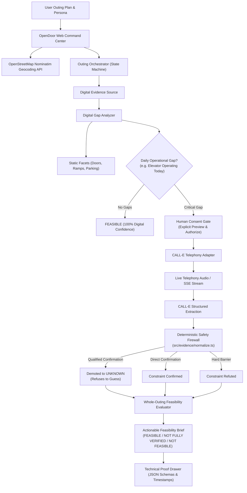
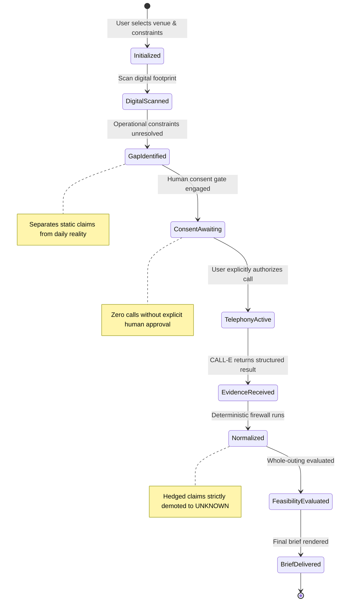

# OpenDoor — System Architecture

OpenDoor is a deterministic accessibility feasibility command center that combines digital evidence with targeted, authorized CALL-E telephony actuation to answer the question: *"Can I actually go?"*

---

## Architectural Data Flow

---

## State Machine Lifecycle

---

## Core Architectural Invariants

1. **Provider Separation:** The telephony engine (CALL-E) is an actuator for gathering spoken evidence. It does not decide feasibility; local deterministic policy decides feasibility.
2. **Explicit Provenance & Temporal Freshness:** Every piece of evidence retains its exact origin (e.g., `digital_lookup` vs `calle_telephony`), timestamp, and verbatim staff quote.
3. **Consent-First Actuation:** Phone calls create physical-world side effects. The agent never dials automatically—it halts and requires human authorization with an explicit question preview.
4. **Deterministic Demotion Firewall:** If venue staff qualifies an answer (*"I think..."*, *"probably"*, *"should be"*), the safety normalizer strictly demotes the response from Confirmed to `UNKNOWN`. It refuses to fabricate confidence.
5. **Fail-Closed Safety:** If a call fails, times out, or encounters a busy line, the outing is marked `NEEDS_REVIEW` or `NOT FULLY VERIFIED`—never assumed accessible.
6. **No Phantom Certification:** OpenDoor provides a point-in-time feasibility assessment for an individual's specific constraints. It never issues generic, universal accessibility badges.

---

## Component Map

| Component | Implementation File | Responsibility |
|---|---|---|
| **Web Command Center** | [`public/index.html`](../public/index.html), [`public/app.js`](../public/app.js) | 3-Panel glassmorphism layout, Web Audio API waveform canvas, SSE event receiver. |
| **Outing Orchestrator** | [`src/application/orchestrator.ts`](../src/application/orchestrator.ts) | State machine coordinating digital scans, consent gating, and telephony. |
| **CALL-E Adapter** | [`src/call-e/adapter.ts`](../src/call-e/adapter.ts) | CALL-E API/telephony interface, idempotency management, and consent enforcement. |
| **Voice & Waveform Engine** | [`src/call-e/voice-engine.ts`](../src/call-e/voice-engine.ts) | Server-Sent Events (SSE) audio streaming, speech pacing, and frequency data simulation. |
| **Curated Scenarios** | [`src/call-e/scenarios.ts`](../src/call-e/scenarios.ts) | 4 Deterministic judge edge cases (Hero Demotion, Full Confirmation, Hard Barrier, Timeout). |
| **Global Place Search** | [`src/evidence/dynamic-search.ts`](../src/evidence/dynamic-search.ts) | Live OpenStreetMap Nominatim geocoding and accessibility tag extraction. |
| **Deterministic Normalizer** | [`src/evidence/normalize.ts`](../src/evidence/normalize.ts) | The safety firewall that demotes qualified/hedged verbal statements. |
| **Feasibility Evaluator** | [`src/domain/feasibility.ts`](../src/domain/feasibility.ts) | Whole-outing constraint-satisfaction engine and verdict producer. |
