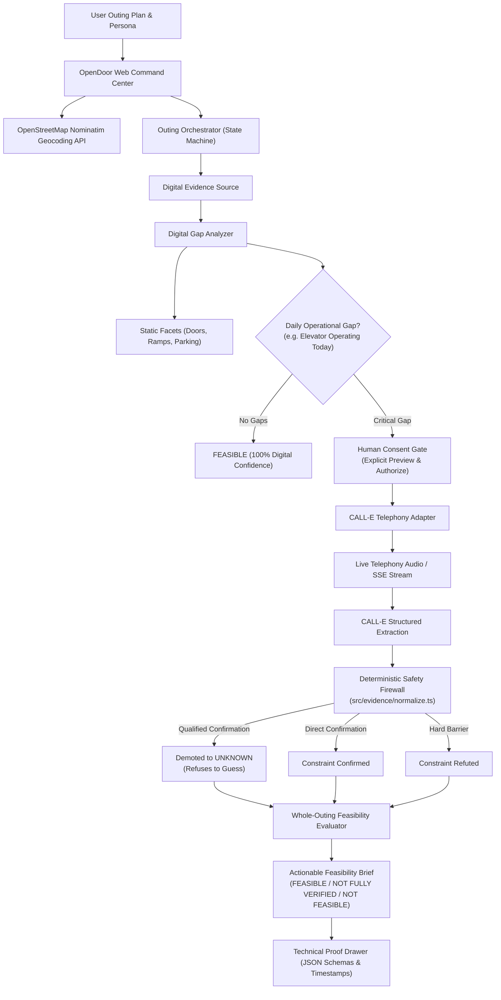
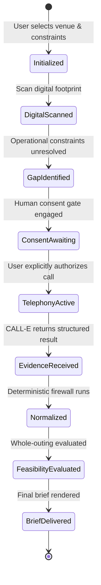

# OpenDoor — Accessibility Feasibility Command Center

> **"The internet can provide claims about a place. OpenDoor determines whether those claims are enough to safely answer 'Can I actually go?'—and uses CALL-E to verify the physical world when they are not."**

[](https://devpost.com)
[](https://www.typescriptlang.org/)
[](LICENSE)
[](#the-causal-proof-chain)
[](#verification--automated-tests)

---


---

## The Problem OpenDoor Solves

Planning an accessibility-sensitive outing (e.g. for a power wheelchair user, someone who is deaf, or a person with sensory sensitivities) currently relies on static online directory tags (`"Wheelchair Accessible"`). 

These static claims routinely fail in the physical world:
- **The Elevator Paradox:** A theater's website may claim they have an elevator. But is it **working today**? Did maintenance sign off on it this morning?
- **The Hallucination Trap:** Generic conversational AI agents guess or return vague confidence scores (*"I am 90% sure it is accessible"*), stranding vulnerable patrons at physical barriers.

**OpenDoor solves this by turning CALL-E into a bounded physical-world actuator inside a deterministic constraint-satisfaction engine.** It never treats conversational AI as the final authority; instead, it uses telephony to gather spoken evidence and enforces a strict, fail-closed safety firewall.

---

## ⚡ Three-Minute Judge Path (Zero Credentials Required)

Follow this sequence to experience the core thesis and deterministic safety engine in under 3 minutes:

1. **Launch the Command Center:**
   ```bash
   cd OpenDoor-project-files
   npm install
   npm start
   ```
   Open **[http://localhost:3000](http://localhost:3000)** in your browser.

2. **Select Scenario 1: "The Hero Demotion":**
   - In the **Curated Judge Scenarios** list (top-left), click **1. The Hero Demotion**.
   - Notice the venue (*The Grand Theater*), contact number, and patron constraints (*Parking*, *Entrance*, *Elevator*) are populated.

3. **Scan Digital Footprint & Gap:**
   - Click **Scan Digital Footprint & Gap**.
   - Observe that *Step-Free Entrance* and *Designated Parking* pass from digital records.
   - Crucially, observe that **Main Elevator Operating Today** is flagged as a **`CRITICAL PHYSICAL GAP`** because static web data cannot prove daily maintenance status.

4. **Authorize & Dispatch CALL-E:**
   - Review the Human Consent Gate and click **Authorize & Dispatch CALL-E**.
   - Watch the live telephony terminal stream, dual-voice speech synthesis, and real-time audio waveform canvas pulsing in sync with the speech.
   - Listen/read the venue representative's response: *"I think it should be working, but maintenance has not signed off on the morning inspection yet."*

5. **Inspect the Feasibility Brief & Technical Audit Drawer:**
   - Observe the executive verdict: **`NOT FULLY VERIFIED (SAFETY DEMOTION)`**.
   - While generic LLMs would score this as "90% confident", OpenDoor's deterministic safety normalizer **strictly demoted the qualified confirmation to `UNKNOWN`** to prevent a wheelchair user from being stranded.
   - Click **Inspect Proof Chain & Technical Audit Drawer** at the bottom to inspect the millisecond execution timeline and raw CALL-E JSON schema.

6. **Instant Contrast (Scenarios 2–4):**
   - Click **2. Full Confirmation** (*Metropolitan Symphony Hall*) $\rightarrow$ Staff confirms all constraints $\rightarrow$ **`FEASIBLE (100%)`**.
   - Click **3. Hard Physical Barrier** (*The Rooftop Lounge*) $\rightarrow$ Staff reports 42 stone steps $\rightarrow$ **`NOT FEASIBLE`**.
   - Click **4. Telephony Failure** (*Underground Comedy Club*) $\rightarrow$ Line busy / timeout $\rightarrow$ **`NEEDS REVIEW`**.

---

## Architecture & Data Flow



### State Machine Lifecycle



---

## Visual Tour & Platform Walkthrough

### 1. The Accessibility Command Center

*Modern 3-panel command center featuring top navigation, curated judge scenarios, live global venue geocoding, and custom constraint builder.*

### 2. Dynamic Discovery & The Physical Gap

*OpenDoor queries OpenStreetMap and municipal records to confirm static facts (Parking, Step-Free Entrance). Crucially, it identifies daily operational constraints ("Main Elevator Operating Today") as a **CRITICAL PHYSICAL GAP** and prompts the Human Consent Gate.*

### 3. Bounded CALL-E Telephony & Live Waveform

*Upon explicit authorization, CALL-E dials the venue contact. The terminal features real-time Web Audio API waveform telemetry and dual-voice speech synthesis.*

### 4. The Hero Demotion (Deterministic Safety Firewall)

*When staff responds with ambiguity ("I think it should be working..."), OpenDoor's deterministic safety normalizer strictly demotes the claim from Confirmed to `UNKNOWN (STRICT SAFETY DEMOTION)`, issuing an executive verdict of **NOT FULLY VERIFIED** to protect the patron.*

### 5. Technical Audit Drawer (Inspect Proof Chain)

*For hackathon judges: Collapsible drawer revealing millisecond timestamps, the strict CALL-E JSON schema passed to the voice model, and raw payload traces.*

---

## The 4 Curated Judge Scenarios

| Scenario | Venue | Persona & Constraints | The Physical Conflict | Safety Engine Decision | Outing Feasibility |
|---|---|---|---|---|---|
| **1. The Hero Demotion** | The Grand Theater | Power Wheelchair User (Elevator + Entrance) | Staff: *"I think it should be working, but maintenance hasn't checked it today."* | `qualified_confirmation` $\rightarrow$ **strictly demoted to `UNKNOWN`** | **`NOT FULLY VERIFIED`** |
| **2. Full Confirmation** | Metropolitan Symphony Hall | Wheelchair + Companion Seating | Staff: *"Yes, both elevator banks A and B are active with no interruptions."* | Direct operational certainty | **`FEASIBLE (100%)`** |
| **3. Hard Physical Barrier** | The Rooftop Lounge | Historic Landmark Tour | Staff: *"This is a protected landmark; guests must climb 42 stone steps. No lift."* | `declined` / direct physical barrier | **`NOT FEASIBLE`** |
| **4. Telephony Failure** | Underground Comedy Club | Sensory Sensitive Outing | 3 call attempts timeout / line busy. | Refuses to fabricate confidence | **`NEEDS REVIEW`** |

---

## Implementation Details & Code Mapping

| Subsystem | Source Location | Implementation Responsibility |
|---|---|---|
| **Safety Normalizer** | [`src/evidence/normalize.ts`](OpenDoor-project-files/src/evidence/normalize.ts) | The core firewall that intercepts hedged speech (`qualified_confirmation`) and strictly demotes it to `UNKNOWN`. |
| **Orchestrator** | [`src/application/orchestrator.ts`](OpenDoor-project-files/src/application/orchestrator.ts) | State machine enforcing the digital gap analysis, consent barrier, and reconciliation. |
| **CALL-E Telephony Adapter** | [`src/call-e/adapter.ts`](OpenDoor-project-files/src/call-e/adapter.ts) | Bounded telephony execution, strict JSON schema injection, and idempotency keying. |
| **Real-Time Voice Engine** | [`src/call-e/voice-engine.ts`](OpenDoor-project-files/src/call-e/voice-engine.ts) | Server-Sent Events (SSE) streaming engine delivering synchronized audio chunks and waveform telemetry. |
| **Global Place Search** | [`src/evidence/dynamic-search.ts`](OpenDoor-project-files/src/evidence/dynamic-search.ts) | Live OpenStreetMap Nominatim client fetching global venues, phone numbers, and accessibility tags. |
| **Feasibility Domain Engine** | [`src/domain/feasibility.ts`](OpenDoor-project-files/src/domain/feasibility.ts) | Multi-constraint evaluation logic classifying outings into categorical safety verdicts. |
| **Web Command Center** | [`public/index.html`](OpenDoor-project-files/public/index.html), [`public/app.js`](OpenDoor-project-files/public/app.js) | Modern 3-panel UI with Web Audio API visualizer, scenario selector, and collapsible audit drawer. |

---

## Reusable CALL-E Community Skill: `accessible-outing-verifier`

In accordance with the **CALL-E: Your Code Is Calling** hackathon requirements, this repository packages a reusable Agent Skill ready for upstream pull request to [`CALLE-AI/awesome-phone-call-agents`](https://github.com/CALLE-AI/awesome-phone-call-agents).

- **Location:** [`submission/calle-skill/`](OpenDoor-project-files/submission/calle-skill/)
- **Specification:** [`submission/calle-skill/SKILL.md`](OpenDoor-project-files/submission/calle-skill/SKILL.md) (Standard YAML frontmatter, explicit safety boundaries, and workflow)
- **Extraction Schema:** [`submission/calle-skill/references/calle-task-schema.json`](OpenDoor-project-files/submission/calle-skill/references/calle-task-schema.json)
- **Standalone Offline Runner:** [`submission/calle-skill/scripts/verify-outing.mjs`](OpenDoor-project-files/submission/calle-skill/scripts/verify-outing.mjs)
- **Testing Standalone:**
  ```bash
  node OpenDoor-project-files/submission/calle-skill/scripts/verify-outing.mjs
  ```

---

## Verification & Automated Tests

OpenDoor maintains 100% deterministic test coverage across all domain invariant policies, evidence normalizers, dynamic search adapters, and scenario reconciliations.

```bash
cd OpenDoor-project-files
npm test
```

```text
Test Suites: 10 passed, 10 total
Tests:       32 passed, 32 total
Snapshots:   0 total
Time:        19.7 s
Ran all test suites.
```

---

## Technical Specifications & Documentation

- 📐 **[System Architecture](OpenDoor-project-files/docs/architecture.md):** Complete component specifications, Mermaid data flows, and state machine lifecycle.
- 🛡️ **[Safety Model & Invariants](OpenDoor-project-files/docs/safety-model.md):** The Elevator Paradox, fail-closed boundaries, and deterministic demotion policy.
- 🧪 **[Curated Scenarios Guide](OpenDoor-project-files/docs/scenarios.md):** Detailed breakdown of the 4 judge test cases and live global search.
- 📋 **[Judge Testing Guide](OpenDoor-project-files/submission_assets/testing-instructions.md):** Step-by-step hands-on evaluation manual for judges.

---

## License

Released under the [MIT License](LICENSE).
